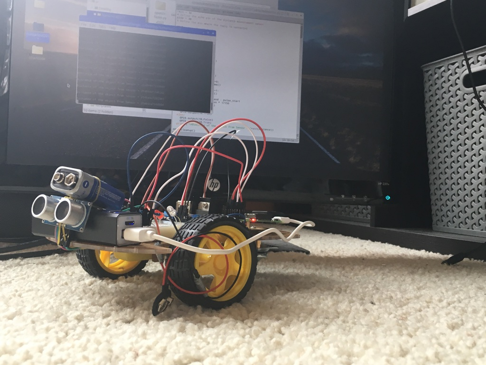
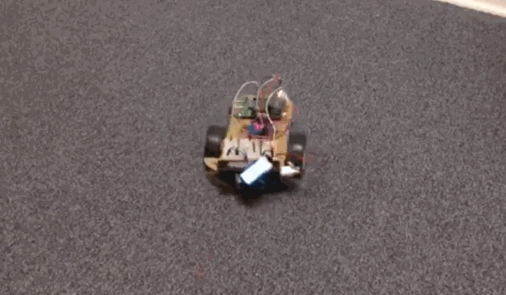
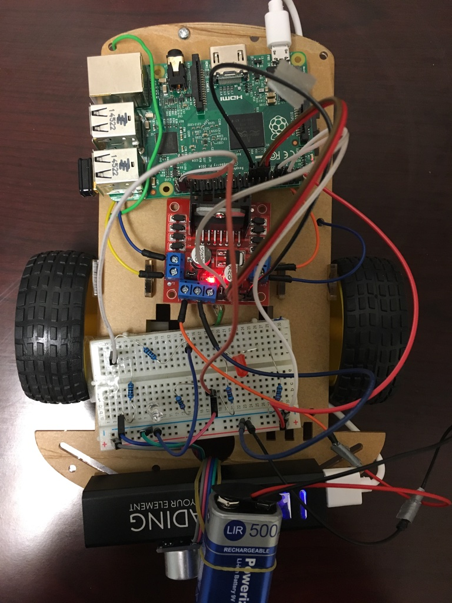
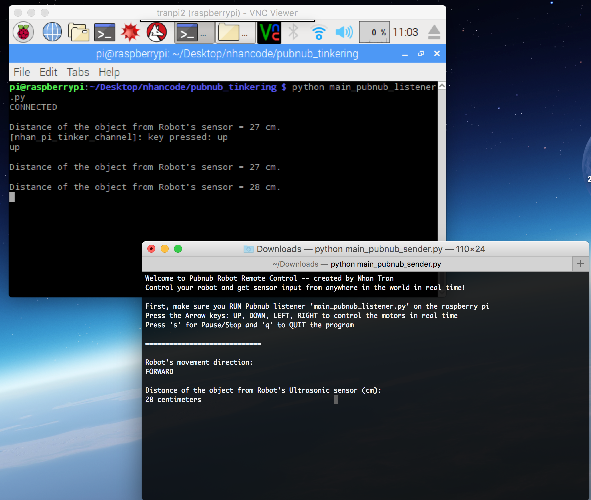

<p align = "center">
    
</p>

<br>

This IoT project utilizes PubNub API to control a small robot car and receive collected ultrasonic sensors data from anywhere in the world in real time!

<p aligh = "center">
    
</p>

## Setup
* Linux machine
* A basic robot or a chassis from an old RC car
* 5V Portable Power Bank to power raspberry pi via USB
* 9V Li-ion battery to power motors
* H-Bridge L298N to control motors
* Ultrasonic sensors HR-S04, 1k and 2k resistors
* Lots of jumper wires (male to female, male to male, female to female...)
* Motors
* Raspberry Pi 2 Model B
    * Python 3 or 2
    * [PubNub 3.9.0](https://www.pubnub.com/docs/python/pubnub-python-sdk)
    * [RPi.GPIO](https://pypi.python.org/pypi/RPi.GPIO)
    * [curses] (https://docs.python.org/2/library/curses.html)

## Wiring

See below pictures:

<p align = "center"></p>
- Motors and 9V battery to H-Bridge L298N. Then from H-Bridge -> Pi in pins 7,11,13,15

Ultrasonic Sensor Wiring:
```
https://www.modmypi.com/blog/hc-sr04-ultrasonic-range-sensor-on-the-raspberry-pi
```
TRIG goes to pin 36 and ECHO is plugged in to pin 38 of the Pi.

## How it works
- This project utilizes PubNub--global Data Stream Network and realtime infrastructure-as-a-service.

- There are two main files needed to be run on Raspberry Pi and another computer: the sender (main_pubnub_sender.py) could be run on any computers and the Pubnub listener (main_pubnub_listener.py) which must be run on the raspberry pi.
- The listener on the pi subscribes to PubNub's channel nhan_pi_tinker_channel which responds to whatever the user enters while running the sender.
- The listener file also contains multiprocessing program which consists of a listener that controls the motor according to the sender and a publisher to send ultrasonic sensor data off to the sender.

- The sender on any computer is programed with Python curses. It might not run well on Windows. Linux or Mac should run it fine. The sender publishes whatever the user presses to the channel so that the listener could respond accordingly.
- The sender also subscribes to "nhan_ultrasonic_channel" in order to update the distance between the robot and surrounding object in real time.

- The files in the other_tests directory were my initial code to get the basic raspberry pi working with motors and keyboards. Some python files were also my practice following PubNub online tutorials, too.

## Usage

Make sure PubNub 3.9.0 is installed on both Pi and computer:
```
pip install 'pubnub==3.9.0'
```

On Raspberry Pi, run the PubNub listener
```
python main_pubnub_listener.py
```
<br>
On another computer or device, run the PubNub sender:
```
python main_pubnub_listener.py

```

<br>
- While running the PubNub sender, you should be able to see some instructions in the terminal screen. 
- Press the Arrow (up, down, left, right) to control the robot movement. 
- Press 's' to pause/stop
- Press 'q' to quit program
- You should be able to see the sensor data of the distance between the robot and nearyby object in the sender's terminal screen. It gets updated in real time thanks to PubNub feature!


<p align = "center">
Demo pic of two terminals (top left the Pubnub listener is running on the Pi, and on the bottom right, the PubNub sender is sending keyboard value to control the robot in real time.
    
</p>

## Future work
- I plan on attaching a webcam to the pi and tinkering with Computer Vision library OpenCV so that I can control the robot far far away while seeing the livestream of what is happening. The OpenCV will add the human facial recognition feature, too!

## Developed by 
[Nhan Tran](http://trannhan.com)
